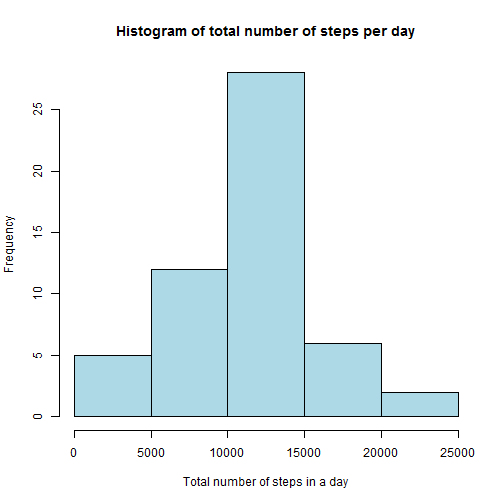
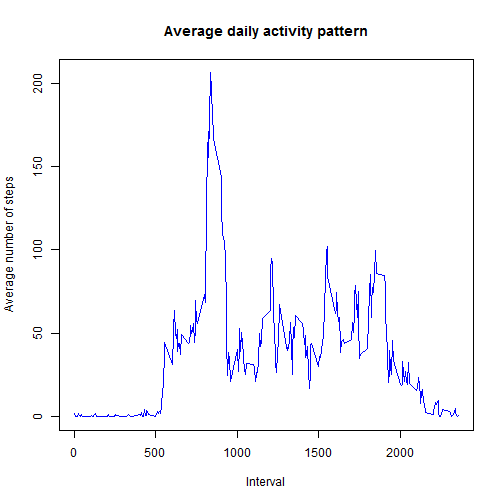
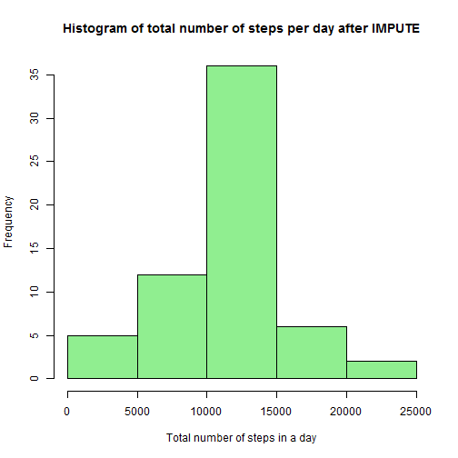
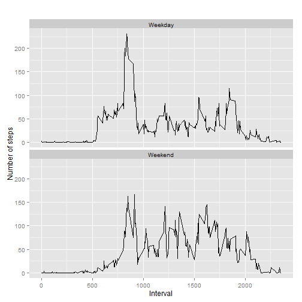

### Load libraries needed for this assignment

```r
library(dplyr)
```

```
## 
## Attaching package: 'dplyr'
## 
## The following objects are masked from 'package:stats':
## 
##     filter, lag
## 
## The following objects are masked from 'package:base':
## 
##     intersect, setdiff, setequal, union
```

```r
library(knitr)
library(ggplot2)
```

#### Setting global option
Throughout your report make sure you always include the code that you used to generate the output you present. When writing code chunks in the R markdown document, always use echo = TRUE so that someone else will be able to read the code. This assignment will be evaluated via peer assessment so it is essential that your peer evaluators be able to review the code for your analysis.

```r
opts_chunk$set(echo = TRUE)
```

#### Setting working directory

```r
setwd("C:\\temp1\\Coursera\\Reproducible Research\\Week2\\Assignment")
```

## Loading and preprocessing the data
1. Load the data (i.e. read.csv())

```r
data_asis <- read.csv("activity.csv")
```
#### Displaying field names

```r
names(data_asis)
```

```
## [1] "steps"    "date"     "interval"
```
2. Process/transform the data into a format suitable for your analysis

```r
activity_data <- na.omit(data_asis)
```


## What is mean total number of steps taken per day?
1. Calculate the total number of steps taken per day

  * Aggregate steps per date to get total number of steps in a day

```r
aggtot <- aggregate(steps ~ date, activity_data, sum)
```
2. Make a histogram of the total number of steps taken each day

```r
hist(aggtot$steps, col="lightblue", main="Histogram of total number of steps per day",
     xlab="Total number of steps in a day")
```

 


3. Calculate and report the mean and median of the total number of steps taken per day

```r
round(mean(aggtot$steps, na.rm=TRUE),0)
```

```
## [1] 10766
```

```r
round(median(aggtot$steps, na.rm=TRUE),0)
```

```
## [1] 10765
```


## What is the average daily activity pattern?
1. Make a time series plot (i.e. type = "l") of the 5-minute interval (x-axis) and the average number of steps taken, averaged across all days (y-axis)

```r
avgdailyactivity <- aggregate(steps ~ interval, activity_data, mean)

plot(avgdailyactivity$interval, avgdailyactivity$steps, type = "l", col="blue",
     main="Average daily activity pattern",
     xlab="Interval", 
     ylab="Average number of steps")
```

 


2. Which 5-minute interval, on average across all the days in the dataset, contains the maximum number of steps?

```r
maxsteprow <- which.max(avgdailyactivity$steps)
intvsteps <- avgdailyactivity[maxsteprow, ]
intvsteps$interval
```

```
## [1] 835
```

```r
intvsteps$steps
```

```
## [1] 206.1698
```
>*The interval [835] has the maximum average value of steps [206.1698113]. *


## Imputing missing values

1. Calculate and report the total number of missing values in the dataset (i.e. the total number of rows with NAs)

```r
totmissval <- sum(is.na(data_asis))
```
>*Total number of missing values in the dataset is [2304] *

2. Devise a strategy for filling in all of the missing values in the dataset. The strategy does not need to be sophisticated. For example, you could use the mean/median for that day, or the mean for that 5-minute interval, etc.

 * *My strategy for filling in all of the missing values in the dataset is with mean for that 5 minutes interval by looping through the dataset, find the value of interval and replace the NA with it*


3. Create a new dataset that is equal to the original dataset but with the missing data filled in.

```r
misdataimpute <- data_asis
for (i in 1:nrow(misdataimpute)) {
        if (is.na(misdataimpute$steps[i])) {
                interval_value <- misdataimpute$interval[i]
                steps_value <- avgdailyactivity[
                        avgdailyactivity$interval == interval_value,]
                misdataimpute$steps[i] <- steps_value$steps
        }
}

newdataset <- aggregate(steps ~ date, misdataimpute, sum)
```

4. Make a histogram of the total number of steps taken each day and Calculate and report the mean and median total number of steps taken per day. Do these values differ from the estimates from the first part of the assignment? What is the impact of imputing missing data on the estimates of the total daily number of steps?


```r
hist(newdataset$steps, col="lightgreen", main="Histogram of total number of steps per day after IMPUTE", xlab="Total number of steps in a day")
```

 

>**Mean & Median value [BEFORE] impute**

```r
round(mean(aggtot$steps, na.rm=TRUE))
```

```
## [1] 10766
```

```r
round(median(aggtot$steps, na.rm=TRUE))
```

```
## [1] 10765
```

>**Mean & Median value [AFTER] impute**

```r
round(mean(newdataset$steps))
```

```
## [1] 10766
```

```r
round(median(newdataset$steps))
```

```
## [1] 10766
```

>*The mean value remains same BEFORE and AFTER impute but there is a slight change in the median value*

## Are there differences in activity patterns between weekdays and weekends?
For this part the weekdays() function may be of some help here. Use the dataset with the filled-in missing values for this part.

1. Create a new factor variable in the dataset with two levels - "weekday" and "weekend" indicating whether a given date is a weekday or weekend day.

```r
misdataimpute['daytype'] <- weekdays(as.Date(misdataimpute$date))
misdataimpute$daytype[misdataimpute$daytype %in% c('Saturday','Sunday') ] <- "Weekend"
misdataimpute$daytype[misdataimpute$daytype != "Weekend"] <- "Weekday"
misdataimpute$daytype <- as.factor(misdataimpute$daytype)
impstepsbyinterval <- aggregate(steps ~ interval + daytype, misdataimpute, mean)
```

2. Make a panel plot containing a time series plot (i.e. type = "l") of the 5-minute interval (x-axis) and the average number of steps taken, averaged across all weekday days or weekend days (y-axis). See the README file in the GitHub repository to see an example of what this plot should look like using simulated data.

```r
qplot(interval,
      steps,
      data = impstepsbyinterval,
      type = 'l',
      geom=c("line"),
      xlab = "Interval",
      ylab = "Number of steps",
      main = "") +
        facet_wrap(~ daytype, ncol = 1)
```

 
